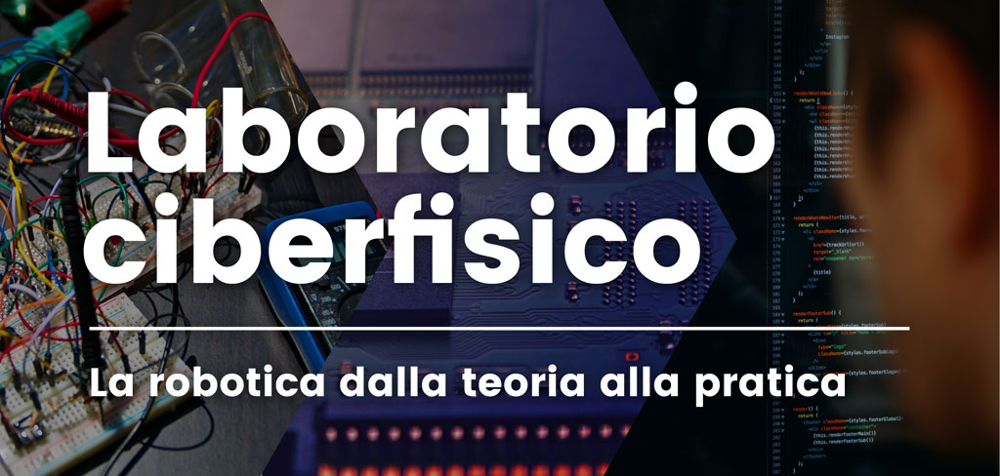

# univr_turtle<br>ROS turtlesim based example

This file is part of univr_turtle and it is distributed under the terms of the
GNU Lesser General Public License (Lesser GPL) <br >

The files in univr_turtle contain the ROS based implementation for
a turtle moving in a circle that can be controlled by using
keyboard arrow commands



## Getting Started

### Prerequisites

You need [ROS Kinetic](http://wiki.ros.org/kinetic/Installation) installed and working

### Try it

You can try it by calling on a terminal <br >
note: univr_turtle is the package's name

```
roslaunch univr_turtle univr_turtle.launch
```

## License

This file is part of hello_ros and it is distributed under the terms of the GNU Lesser General Public License (Lesser GPL) <br >
Visit <http://www.gnu.org/licenses/> <br >
univr_turtle is distributed in the hope that it will be useful,
but WITHOUT ANY WARRANTY; without even the implied warranty of
MERCHANTABILITY or FITNESS FOR A PARTICULAR PURPOSE.  See the
GNU Lesser General Public License for more details.

You should have received a copy of the GNU Lesser General Public License
along with univr_turtle. If not, see <http://www.gnu.org/licenses/>.

## References

***Laboratorio Ciberfisico*** <br >
[Robot Programming with ROS](http://profs.scienze.univr.it/%7Ebloisi/corsi/ciberfisico.html) <br >
A.Y. 2017/2018 <br >
University of Verona (Italy)

